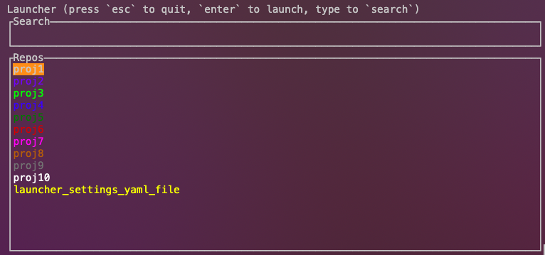

# Launcher

Shortcuts to open directories (with IDEs, in finder etc.) from terminal, built in Rust.  
Note: only supports iterm2 (neither windows nor macOS terminal support)



## Setup

Note: a proper build of the project is a work in progress.  
If you do want to run this now, you must ensure that you you have rust installed. You can find instructions [here](https://www.rust-lang.org/tools/install).

You will need to change [this](https://github.com/JoelSaleem/launcher/blob/main/src/repo.rs#L25) line in your local project to match your filepath (note, this will eventually be changed, but not right away).

Then clone, the repo. From within the launcher root directory run:

```bash
cargo build
```

And then follow the instructions below.

### Launcher Directory

```bash
mkdir ~/.launcher
```

### Settings.yaml

In the .launcher directory from the previous step, create a file and call it `settings.yaml`. In this file, you should list the paths to the files/directories/repos with the path variables with which you can open the directories/files.

The schema of the file is as follows:

```yaml
repos:
  - proj1:
      id: name_you_want_to_appear_in_term
      path: absolute_file_path_to_directory_or_file
      color:
        r: 0 # some integer between 0-255
        g: 0 # some integer between 0-255
        b: 0 # some integer between 0-255
      keyword: code # path variable /alias you need to open the dir (e.g. code for vscode)
  - proj2:
      id: name_you_want_to_appear_in_term
      path: absolute_file_path_to_directory_or_file
      color:
        r: 0 # some integer between 0-255
        g: 0 # some integer between 0-255
        b: 0 # some integer between 0-255
      keyword: open # path variable you need to open (e.g. open to open in finder)
```

### Binary

The binary output from cargo can befound in:  
`path_to_launcher_root/target/debug/launcher`
This binary should be copied

### Alias

In your alias file for the terminal you're using (e.g. ~/.zshrc), create an alias to run the binary.

## Usage:

Once Launcher has been opened, you can use the `arrow keys` (up and down) to scroll through the list of options. Press `enter` to execute. Press `esc` to quit. And also start typing to filter the options list. Note: the search functionality is an exact, contiguous substring, so no fuzzy search etc.
